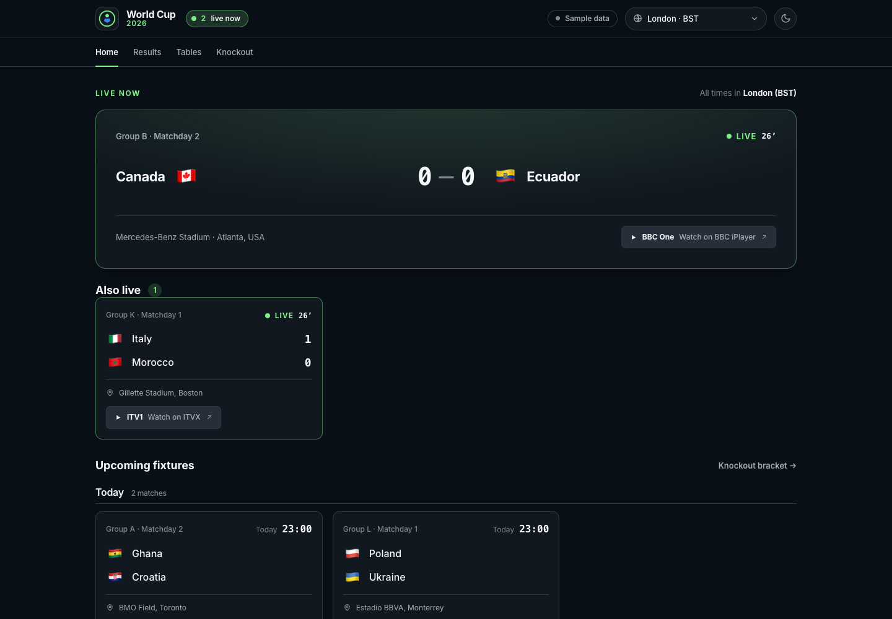
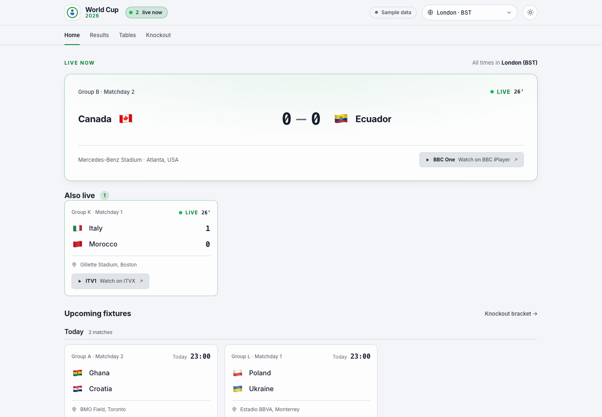

# World Cup 2026 Dashboard

A fast, timezone-aware companion for the FIFA World Cup 2026. Built to answer the
matchday questions in one glance: **what's on next, when does it kick off in my time,
and where do I watch it in the UK?**

| Dark | Light |
| --- | --- |
|  |  |

## Features

- **Home** — the live match (or next kickoff) front and centre with a running clock or
  countdown, plus upcoming fixtures grouped by day.
- **Timezone aware** — every kickoff renders in your chosen timezone. Defaults to
  **London (BST)**; switch to any host-nation or common fan zone from the header. Your
  choice is remembered.
- **Where to watch (UK)** — each match shows its UK broadcaster (BBC / ITV) with a direct
  link to stream it on iPlayer or ITVX.
- **Results** — every finished match, newest first, filterable by stage or group.
- **Group tables** — all 12 groups with computed standings, qualification zones, form
  guides, and the best-third-placed race.
- **Knockout bracket** — the full Round of 32 → Final tree, with provisional seedings
  drawn from the live standings until each group is decided.
- **Light / dark / system theming** — a header toggle cycles System → Light → Dark. The
  choice is remembered, *System* tracks your OS live, and the theme is applied before first
  paint (no flash).
- **Live, accessible, responsive** — live status pulses, WCAG AA contrast, status never
  by colour alone, full keyboard support, `prefers-reduced-motion` honoured, and a mobile
  bottom-nav layout that works down to small phones.

## Tech

- **React 19 + TypeScript + Vite** (production server on Node 22)
- **React Router** for the four routes
- **No date library** — kickoff times are stored in UTC and rendered with the built-in
  `Intl` APIs, which handle DST (so `Europe/London` is BST in summer automatically).
- Hand-authored CSS design system: OKLCH tokens with light + dark palettes switched via a
  `data-theme` attribute. See [`DESIGN.md`](DESIGN.md) and [`PRODUCT.md`](PRODUCT.md).

## Getting started

```bash
npm install
npm run dev      # start the dev server
npm run build    # type-check + production build
npm run preview  # preview the production build
```

## Data: live with seed fallback

The app has two data sources behind one interface ([`src/data/source.ts`](src/data/source.ts)):

- **Seed** — deterministic sample data in the official 48-team format (12 groups, 16 host
  venues, BBC/ITV rights split). Always available, offline, instant.
- **Live** — the [football-data.org](https://www.football-data.org/) World Cup feed
  ([`src/data/live.ts`](src/data/live.ts)).

It **renders the seed data instantly, then upgrades to live in the background** and
re-polls every 60s. If the live fetch fails (no key, network, rate limit), it silently
stays on whatever it has. The header shows a **Live data / Sample data** badge.

Standings are always computed in-app from completed matches, so the seed and live paths
behave identically. No sports API reports UK TV rights, so the **BBC/ITV "where to watch"
channel is assigned locally** and deterministically per match in both modes.

### Enabling live data

1. Get a free key at <https://www.football-data.org/client/register>.
2. `cp .env.example .env` and set `FOOTBALL_DATA_TOKEN=your-key`.
3. `npm run dev`.

The token is **never exposed to the browser**. The browser polls our own
`/api/wc/matches` endpoint; a Vite dev-server middleware (see [`vite.config.ts`](vite.config.ts))
fetches football-data.org **once per cache window** (`FD_CACHE_TTL_MS`, default 60s),
injecting the `X-Auth-Token` server-side, and fans that single response out to every
client. So upstream calls are bounded to ~1 per TTL **regardless of how many tabs or
browsers are open**, with:

- **request coalescing** — concurrent callers share one in-flight fetch;
- **stale-while-error** — a failed or throttled refresh keeps serving the last good data
  rather than erroring;
- **a bounded upstream call** — `FD_UPSTREAM_TIMEOUT_MS` (default 8s) so a hung upstream
  can't stall clients; upstream error details are logged server-side, never forwarded.

Responses carry `X-Cache: HIT | REFRESH | STALE | MISS` headers. The same code runs in
production ([`server/feed-cache.mjs`](server/feed-cache.mjs)).

For production, point `VITE_MATCHES_URL` at an equivalent caching proxy (e.g. a
serverless function) that adds the header. Set `VITE_USE_LIVE=false` to force seed mode.
A raw passthrough proxy is also available at `/fd/*` for manual/direct access.

> football-data.org's free tier allows 10 requests/minute; one shared call per 60s stays
> far under. Group/knockout coverage of the 2026 edition depends on your plan — when a
> field (e.g. venue) is missing the app falls back cleanly.

### Demo clock

By default the dashboard uses the real wall clock. To preview a specific moment (for
example, to see the live state), freeze time with a query parameter:

```
/?now=2026-06-16T20:30:00Z
```

## Deployment (single container)

Production runs as **one static Go binary** ([`server/`](server)) that serves the built
SPA *and* the cached `/api/wc/matches` endpoint. The dev server mirrors the same cache
logic from [`server/feed-cache.mjs`](server/feed-cache.mjs), so behaviour is identical. No
separate API service to run.

Run it locally (needs Go + Node):

```bash
npm run serve          # build SPA, then `go run ./server` on :8080
```

Or with Docker (multi-stage build → distroless static image, non-root, ~15 MB):

```bash
docker build -t wc-dashboard .
docker run -p 8080:8080 -e FOOTBALL_DATA_TOKEN=your-key wc-dashboard
# open http://localhost:8080
```

Or Compose (reads `FOOTBALL_DATA_TOKEN` from a local `.env`):

```bash
docker compose up --build
```

The token is passed as an **environment variable to the container** and stays server-side;
it's never in the image or the client bundle. Without a token the container still runs and
serves the seed data. Runtime env vars: `PORT` (default 8080), `FOOTBALL_DATA_TOKEN`,
`FD_CACHE_TTL_MS` (default 60000), `FD_UPSTREAM_TIMEOUT_MS` (default 8000),
`VITE_COMPETITION`, `FD_UPSTREAM`. Health check at `/healthz` (used by the Docker
`HEALTHCHECK`). `docker-compose.yml` runs with `init: true` so signals are handled and
zombies reaped. Put it behind any reverse proxy / TLS terminator (nginx, Caddy, a PaaS) —
it's a plain HTTP server on one port.

## Project structure

```
src/
  data/        types, teams, venues, broadcasters, seed schedule generation,
               source.ts (seed/live abstraction), live.ts (football-data.org adapter)
  lib/         clock, timezone formatting, match state, standings, knockout, broadcast
  app/         providers (clock, timezone), DataProvider (live fetch + fallback),
               ThemeProvider (light/dark/system), useTournament selector
  components/  Header, Nav, ThemeToggle, MatchCard, FeaturedMatch, StandingsTable, …
  pages/       Home, Results, Tables, Knockout
  styles/      tokens.css (themed), base.css, app.css
server/        *.go (production server: static serving + feed cache),
               feed-cache.mjs (dev-server cache, imported by vite.config.ts)
index.html     includes the pre-paint theme script
Dockerfile · docker-compose.yml
```
